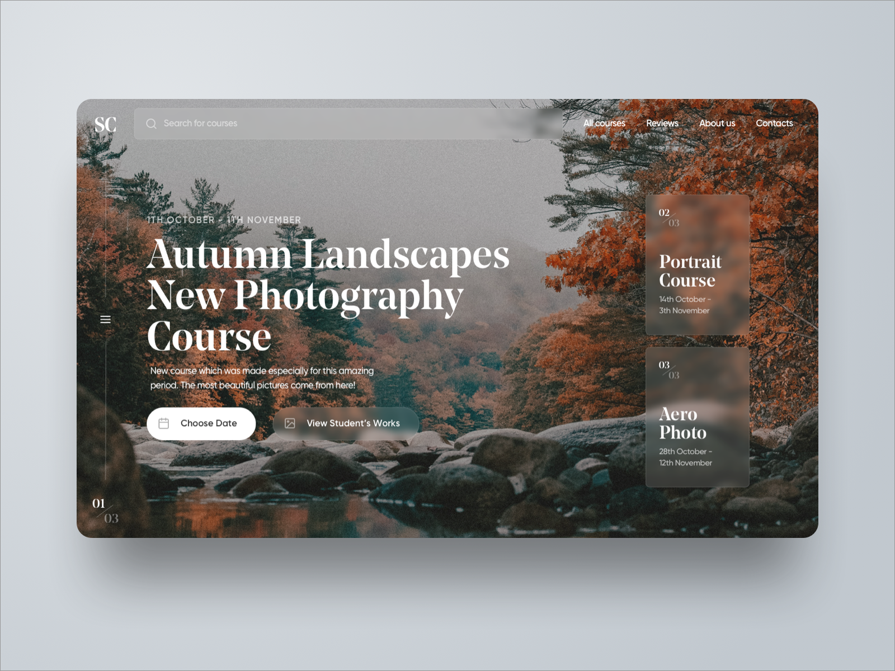

# GA Project 1

This is a project I created for my portfolio during the Software Engineering Immerssive course at General Assembly. This project was made to demonstrate the grasp I have on HTML and CSS. Using just a mockup image. I recreated a site using my own HTML and CSS.

## Mockup Image

This is the image that my website is based on:

### Website Location

The website is listed [here](bmillsmc.github.io/GAproject1/) on Github pages, but you can also feel free to download the repository and check out the code for yourself!

### Suggestions and Changes

I'm always looking to learn and grow as a developer. Even though this is one of my first projects I'm not afraid of critisism. Please don't be afraid to give me suggestions or changes to add to make the site look or run better.

### Repo Installation

If you're new to Github and still want to check out my code heres a step-by-step. 

1. In your terminal 'cd' into the directory you would like the repo to install to
2. Click the green "download or clone" and grab the SSH key to clone
3. Use the command 'git clone [SSH key you just got]' to clone the repo down to your computer
4. Open the code up in your favorite text editor (mines Sublime currently so I do 'subl .') and have a blast playing with my code!

